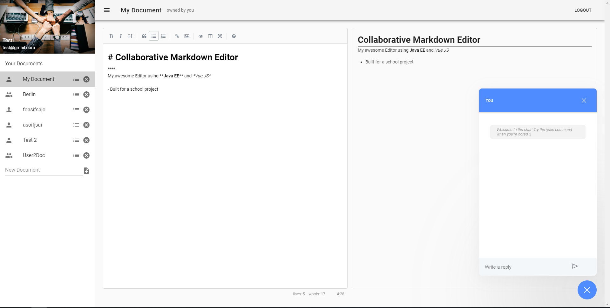
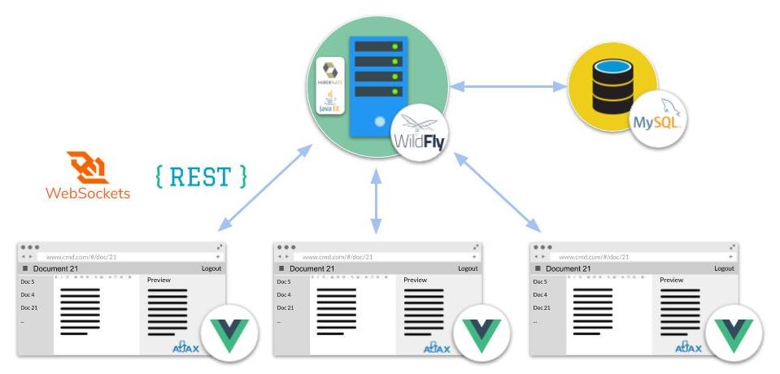
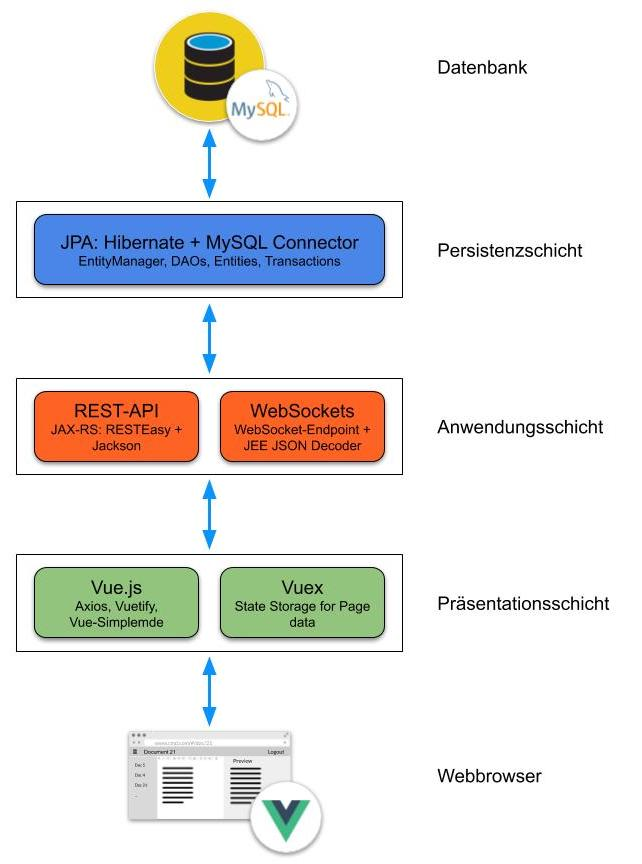

# Collaborative MarkDown Editor

A Markdown Editor with collaboration capabilities. Start with new documents, add your friends and
colleagues to your document and share amazing ideas.



## Features

* User Management
* Users can create and delete documents in their work space
* Synchronization of the clients to be able to collaborate
* Markdown syntax support in the editor
* WYSIWYG toolbar for Markdown
* Live Preview of editor content rendered in Markdown
* Add and remove collaborators to a project
* Preview who is working on a document
* Transfer the ownership of a document
* Chat to communicate with other users currently working on the same document
* Chat commands

## Project Idea

Our idea was born in the 4th semester. To prepare for the exams, Morten in particular summarized
some lecture scripts and used the online markdown editor StackEdit for this purpose. Markdown is
a markup language for structuring and formatting text documents with little syntax. The big problem
with StackEdit, however, was that it is not multi-user.

## Setup

### Docker-Compose

First you should check which versions of Docker and Docker-Compose you have. It should be at least
Docker version 18.0 and Docker-Compose 1.23, so that the declared features are fully supported. To
build and start the containers you can use the simple command

```bash
docker-compose up
```

right from the project directory. A whole series of operations are now performed here, which are
listed below.

1. The basic images `mysql` and `jboss/wildfly` are downloaded from Docker Hub.
2. The MySQL image is built, a root user and a database user are set up, and the database is
   initialized.
3. The WildFly image is built.
4. First, Maven is used to build the application in another container. This includes building
   the frontend directly, since the Maven frontend plugin is used.
5. An administrator account is added to the WildFly.
6. The MySQL connector is downloaded and installed at WildFly. In addition, a data source is
   set up directly to allow the connection to the database in the other container.
7. The WAR archive previously built by Maven is deployed to WildFly.
8. Wildfly and MySQL are started simultaneously.

Open your browser at http://localhost:8080 and see the editor appearing.

### Maven Deploy

Maven Deploy can be used as an alternative to the Docker image. This is made possible by the
Wildfly Maven plugin. Again, the plugin downloads and starts a Wildfly 16.0.0.Final and
configures it with MySQL Connector and Datasource.

To do this, the Wildfly must first be started with the command

```bash
mvn wildfly:start
```

This is required to then add the MySQL connector and data source and deploy the application.
Before you can continue, however, you must make sure that a MySQL database is present on the
machine and running. The connection information (JDBC URL, username, password) must be stored
in Maven `pom.xml` in the properties

* `wildfly.datasource.jdbc.url`
* `wildfly.datasource.username`
* `wildfly.datasource.password`

to perform the complete Maven lifecycle from compiling the software, building the Vue.js frontend,
generating a JaCoCo coverage report, packing the application into a WAR archive, configuring the
Wildfly and deploying the application.

```bash
mvn wildfly:deploy -P deployment -DskipTests=true
```

Your Wildfly should now be deploying your application and you can verify by visiting http://localhost:8080.

## Deployment

[](https://heroku.com/deploy)

## Architecture

### Client-Server-Model



### 3-Tier Architecture


